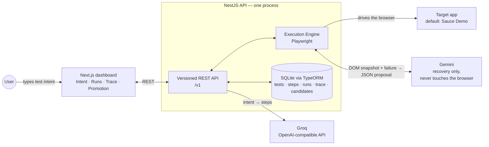

# Architecture — Hybrid Test Execution

Two application packages in one pnpm workspace. The API is one NestJS process;
there is no queue, worker, container, or SSE stream.

**The loop:** The user submits intent and a target URL. The API asks the
OpenAI-compatible Groq endpoint for ordered steps and stores them in SQLite.
Playwright runs the saved steps in a browser page. When a step is deliberately
broken or fails, the engine sends the current interactive DOM snapshot and
failure context to Gemini. Gemini returns a structured recovery action; the
engine validates and executes it on the same page. A recovered step becomes a
promotion candidate. Human approval updates the stored step in SQLite so later
runs can use it deterministically.
