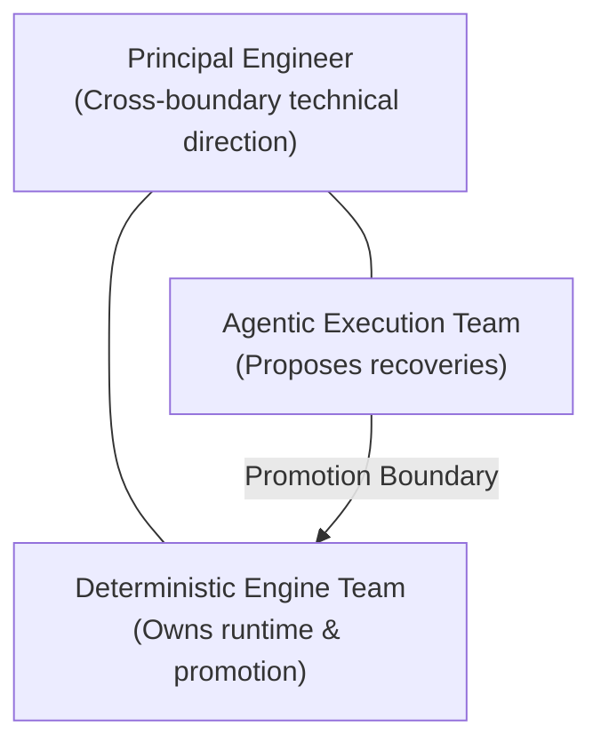

# Inheriting v0 — Diagnosis, Direction, and the SLOs That Matter

**Author**: Candidate (Engineering Manager, AI)  
**Target Audience**: Founding Team & Executive Leadership, Testsigma  
**Subject**: Hybrid Test Execution Platform — Diagnosis, 90-Day Execution Plan, SLOs, Governance & Team Topology  
**Repository Context**: Grounded in `e2e-hybrid-executor` (NestJS API + Playwright Engine + Gemini Recovery + Groq Intent Builder + Next.js Dashboard)

---

I built a working prototype of this hybrid loop as Component A. It isn't your v0, and I'm assuming nothing about how yours is built — the real v0 may be architected differently, and I'd need your code, traces, and incident history before going deep. The prototype is useful as a source of questions and architectural validation, not a map of your system.

This is my read on what's likely broken, how I'd approach the first 90 days, the service levels I'd hold us to, how I'd present this to customers, how I'd shape the team, and the hardest conversation I expect to have with you. Throughout, I am **firm on the technical direction** and **provisional on people and structure** — I weigh team dynamics as heavily as composition, and I cannot read dynamics from the outside in week one.

---

## 1. What's wrong with v0 — my read

This is a *hypothesis about where to look*, not a final verdict — I will confirm or discard each part against your production traces before acting.

The three customer escalations are not three separate problems. **Two share a single root cause, while one requires empirical trace analysis before drawing conclusions.**

### Root Cause: The agent's decisions are invisible
* Why the agent chose a specific action or substitute selector isn't captured or exposed. Consequently, an *incorrect* recovery (which clicks a substitute element that bypasses the test objective) looks identical in telemetry to a *correct* recovery.
* That single observability gap produces two of your escalations:
  1. **Silent false passes**: The agent recovers in a way that completes DOM navigation but misses the actual application defect.
  2. **Opacity ("Can't debug why")**: Teams can reconstruct *what* happened, but never *why* the agent decided on that action.
* You cannot eliminate silent passes while the "why" remains invisible.

### Slowness in Fallback Mode: Refusing to guess without traces
* One thing is clear from basic execution logic: fallback mode makes *fewer* model calls than agentic-primary (it only invokes the model when a step fails), so it should inherently be *faster* overall. It being 5–10× slower is surprising — which is why I must inspect traces before diagnosing it.
* **Prototype Insight**: In our prototype (`apps/api` NestJS runner + Playwright), we addressed handoff friction by reducing Playwright's per-action wait timeouts from the default 30s down to explicit 2s–5s limits (e.g. 2,000ms for clicks, 5,000ms for fills) and trimming the DOM snapshot sent to Gemini to a compact list of up to 80 interactive elements (`button`, `input`, `a`, `[data-test]`). In v0, I will trace whether slowness stems from unpruned HTML context bloat, default 30s Playwright timeout cascades, or network latency during agent invocation.

### A realistic view of the LLM
As long as we use an LLM (such as Gemini for recovery or Groq for intent parsing), part of the decision-making process remains a black box. I will not pretend observability solves model internals. The plan relies on two practical measures:
1. **Require the agent to justify each action and log it.** Log the justification (`reasoning`) alongside the DOM snapshot and chosen selector. That is the practical form of "why" — directly attacking diagnostic opacity.
2. **Constrain the agent with hard gates.** Accuracy will never be 100%, and I will not design as if it will be. The goal is to *bound* bad behavior: enforce DOM selector presence checks, post-condition state assertions, and human review before script promotion. **The gate is the product** — what we sell isn't unconstrained AI recovery, but the verifiable check that decides which recoveries can be trusted.

### What I refuse to conclude in week one
I will refuse to conclude without empirical evidence that slowness is inherently architectural, that silent passes are "just prompt tuning," or that the current team cannot hit the required bar.

---

## 2. The first 90 days (direction, not a rigid plan)

**Principle: Measure trust before improving it.** You cannot fix a metric you have never baselined.

* **Days 1–30 (Listen, Instrument & Baseline)**: Understand team dynamics and engineering composition. Read code, traces, and incident histories. Confirm or adjust the diagnosis above with the engineers who built v0. Instrument the runner so the agent logs step justifications with immutable `stepId` tags. Get the current **silent-pass rate** on paper — even if ugly, it is the baseline against which all progress is measured.
* **Days 30–60 (Make Green Trustworthy)**: Harden validation gates around recoveries. Enforce post-condition state assertions so an agent cannot click past a defect. Ship the promotion queue in the web dashboard (`apps/web`) to production so every human approval or rejection creates ground-truth evaluation data. Resolve handoff slowness based on trace evidence. Publish initial SLO targets.
* **Days 60–90 (Decide with Evidence)**: Evaluate whether the team and architecture are hitting published SLOs. Make the final go/no-go decision on sub-team structures. Automate the self-healing promotion pipeline so approved steps update stored test definitions for future deterministic execution.

### What I explicitly will NOT fix in this window (and why)
* **Making agentic-primary a release gate**: It remains an authoring and discovery tool until its silent-pass rate is proven low enough to trust.
* **Chasing 100% agent accuracy**: A wrong goal; I invest capacity in guardrails that bound failure modes instead.
* **Scaling and performance beyond known handoff slowness**: Scaling an untrustworthy runner simply ships false greens faster.
* **Big team restructuring on day one**: Not before reading team dynamics firsthand.

---

## 3. Service Level Objectives — 3 modes × 3 dimensions

Targets set without a baseline are arbitrary guesses that collapse under scrutiny. Below, I define the methodology and structure, paired with **provisional Day-1 targets** (labeled as directional estimates to be calibrated against our 2–4 week baseline).

* **Latency**: Step execution duration (p50/p95).
* **Reliability**: The runner reaches a trustworthy end state (pass, fail, or needs-review) without runner crashes.
* **Accuracy**: Whether the execution verdict is actually correct.

| Execution Mode | Latency SLO (p95) | Reliability SLO | Accuracy SLO (Intent Preservation) |
| :--- | :--- | :--- | :--- |
| **Mode 1 — deterministic** | **< 800ms** (fastest, no LLM call) | **99.9%** (No runner crashes) | **N/A by design** *(Governed by test authoring quality)* |
| **Mode 2 — deterministic-with-fallback** | **< 3.5s** (slower only on recovery) | **99.5%** (Fails safe to review) | **~95% Precision / 0% Silent False Passes** *(Provisional Day-1 estimate)* |
| **Mode 3 — agentic-primary** | **< 4.5s** (LLM call per step) | **98.5%** (Fails safe to review) | **~90% Trajectory Accuracy** *(Provisional Day-1 estimate)* |

### Why Mode 1 Accuracy is N/A by Design
Deterministic execution makes no model judgments. The Playwright runner evaluates exact selectors against the DOM without non-deterministic reasoning. The execution engine adds zero accuracy error — the verdict matches the script exactly. Any failure is a human authoring issue, managed under test maintenance rather than runner engine SLOs.

### Accuracy Decomposed (Modes 2 & 3)
A single "accuracy %" conceals critical failure modes. We decompose accuracy into four sub-metrics:

1. **Recovery Precision**: Of AI actions passing validation gates, what percentage correctly satisfy the step intent?
2. **Calibration**: Does stated model confidence correlate with actual correctness? (If confidence scoring is introduced and the model states 0.90 but fails half the time, the gate is ineffective).
3. **Silent-Pass Rate**: How often does a run report `PASSED` while the application contains a defect? *(Target: 0%)*.
4. **Verdict Stability**: Running the identical test against the identical application build N times yields the identical verdict.

### Measuring Accuracy under Non-Determinism
When multiple valid action sequences satisfy the same intent:
1. **Score against postconditions, not click paths**: Assert on target DOM/API end states rather than specific element paths. Two distinct valid paths to the correct postcondition both pass.
2. **Defect Injection Benchmarking**: Intentionally inject application defects; measure whether the runner catches them. Accuracy is the ability to distinguish broken from healthy applications.
3. **Promotion Queue as Ground-Truth Data**: Every human approval or rejection in the promotion queue acts as a labeled evaluation dataset, allowing threshold tuning based on real usage data.

---

## 4. The Customer-Facing Story

When an agent makes a non-obvious decision mid-run, the customer must **see it, audit it, and trust it**.

### What I built in the prototype
In our prototype dashboard (`apps/web`), every agent decision is attributed and visible before becoming permanent:
* **Per-Step Timeline**: Displays execution mode (`deterministic` vs. `deterministic-with-fallback`), step status, duration, and action taken. A release manager can read a run report top to bottom and understand what happened.
* **Decision & Promotion Panel**: On fallback recovery, the UI surfaces the original step, proposed recovered step (`selector`, `action`, `value`), and agent `reasoning` as a **promotion candidate**. Nothing updates the underlying script silently.
* **Human-in-the-Loop Approval**: A human reviewer approves or rejects the recovery, updating the stored step in SQLite so subsequent runs execute deterministically.

```
[ STEP 3 ] CLICK - Sign In Button
├─ Execution Mode: deterministic-with-fallback (Healed in 1.1s)
├─ Original Selector: #login-btn (FAILED: Selector miss)
├─ Recovered Selector: #btn-submit-v2
├─ Agent Reasoning: "Original selector #login-btn missing due to UI drift. 
│  Identified <button id='btn-submit-v2'> matching semantic intent 'Sign In'."
└─ Executive Summary: "Selector #login-btn drifted. AI relocated authentication trigger 
   (#btn-submit-v2), allowing test execution to complete safely."
```

### What I would build next
* **Adaptive Exception-Gated Handoffs**: Hooking directly into Playwright DOM query events to trigger agent fallback instantly upon selector miss after an adaptive 2.5s window, eliminating fixed timeout waiting.
* **Confidence Scoring & Automated Gating**: Expanding the recovery schema to request an explicit confidence score (0.0 to 1.0) from the model and requiring confidence $\ge 0.80$ to create a promotion candidate.
* **Plain-English Run Narratives**: High-level executive summaries suitable for release managers and CTOs (e.g., *"Step 3 selector drifted; agent recovered Sign-In button via role matching. Recovery pending human review."*).
* **Deep Decision Auditing**: Expose alternative candidates evaluated and rejected by the agent during recovery.

**The Honest Promise**: We do not sell black-box "self-healing tests" that hide application bugs. We sell **a test suite you can trust after the application changes underneath it** — fewer false reds, zero false greens, and complete visibility into every recovery.

---

## 5. How I'd shape the team

**Direction: Two specialized sub-teams under one Engineering Manager, supported by a shared Principal Engineer.**



* **Deterministic Engine Team**: Playwright runner, browser session infrastructure, execution throughput, script promotion pipeline.
* **Agentic Execution Team**: Self-healing heuristics, DOM pruning, LLM reasoning (Gemini/Groq), decision logging, accuracy evaluation.
* **Shared Principal Engineer**: Owns cross-boundary architecture and reviews all interface schema changes.

### Rationale & Organizational Alignment
* **Depth of Specialization**: Evaluating non-deterministic LLM behaviors requires a different engineering skill set from tuning Playwright browser contexts. Splitting into sub-teams enables deep focus while keeping both aligned under one Engineering Manager.
* **Org Mirrors Product**: In the product, the agent *proposes* a recovery and a human *approves* it. In the organization, the Agentic team *proposes* recoveries and the Deterministic team *owns promotion integration* into the core runner. This preserves essential architectural checks and balances.

### Ownership Matrix

| Operational Asset | Owner | Rationale |
| :--- | :--- | :--- |
| **Shared Session Infrastructure** | Deterministic Engine Team | Runtime core; Agentic team consumes it via explicit SLAs. |
| **Promotion Lifecycle Engine** | Deterministic Engine Team | Engineers living with runtime stability must own script updates. |
| **Fallback Handoff Protocol** | Joint Ownership (Principal-Led) | Boundary interface requires joint design; incident response uses a single shared on-call rotation. |

**Revisit Trigger**: Operating twin sub-teams creates boundary coordination overhead. If boundary handoff issues represent > 20% of escalations by Day 60, I will merge them into a single consolidated team.

---

## 6. The hardest conversation

*(The conversation I will initiate early — as soon as evidence is gathered, not a quarter late.)*

"I want to raise something early, because raising it late would cost us a quarter we don't have. As I bring this team to the bar this mission requires, it is going to require capability shifts — and not all of them will involve people who are bad at their jobs. Some may be genuinely good engineers. I would rather discuss that openly now than surprise you a quarter from now.

Here is the distinction I am working from: *good* is not identical to *what this mission needs*. We may have strong engineers who excel at classic deterministic automation or manual testing, but who struggle with evaluating non-deterministic agent behavior and working fluently in AI guardrail architectures. Capability is coachable, and I will invest in training first. Fit-to-need sometimes is not, and I will not pretend it is to maintain short-term harmony.

I have made this call before. I had a strong backend engineer in a role that evolved to require full-stack execution. I set clear expectations, provided coaching, and when he chose not to grow into the new scope, he moved on. Retaining him in that role would have been easy, but it would have signaled to the team that performance bars are optional. My ask is this: support me in coaching transparently first — and support me in making hard organizational calls early if coaching does not close the gap."

---

## Concluding Risk Analysis

The most likely way this 90-day plan fails is that **trust never converges** — we log decisions, harden gates, and humans approve recoveries, yet the suite drifts into auto-approving green runs without proving the greens are valid, caused by promotion churn where healed steps repeatedly fail and require re-healing.

**The earliest warning signal is promotion re-heal churn** — if > 15% of steps promoted back to deterministic execution fail again within 14 days, recovery is treating symptoms rather than underlying element intent, and the human gate is becoming a rubber stamp. Tracking this metric weekly will alert us to halt and refine selector confidence gates before customer trust degrades.
